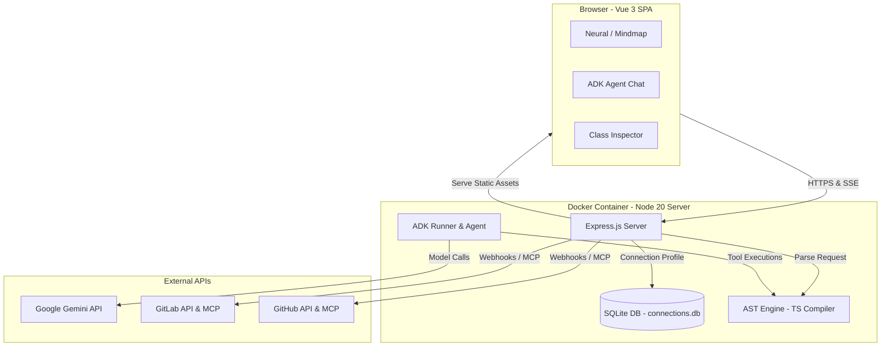

# 🌊 BaseFlow

BaseFlow is an advanced, interactive codebase visualization and AI-assisted software architect platform. It maps out complex code repositories as structured, interactive 2D mindmaps while integrating an autonomous AI assistant powered by **Google Gemini API** (using the Google ADK) to help developers inspect components, perform refactoring risk analysis, and orchestrate automated fixes.

---


## ✨ Features

### 🧠 Core Capabilities
- 🔍 **Multi-Language AST Codebase Parser**: Traverses files recursively to construct structural models using the official `typescript` compiler API for TypeScript/JavaScript/Vue, and regex-based parsers for Python, Java, and C#.
- 🗺️ **Interactive 2D Mindmaps**: Renders classes, modules, inheritance (`extends`), interface implementations (`implements`), and dependency usages in a clean, hierarchical force-directed graph layout.
- 🤖 **Autonomous AI Architect Agent**: Integrates Google's Agent Development Kit (`@google/adk`) with Gemini 3. The agent has **11 tools** to inspect code, navigate the UI, highlight mindmap nodes, write files, and interact with DevOps platforms.
- 🏗️ **AI Architecture Diagrams**: Auto-generates system architecture and class interaction diagrams using Mermaid.js.
- 📄 **Document Q&A**: Analyzes markdown documents in your repository and answers questions in context.

### 🚀 New — AI DevOps Intelligence (GitLab/GitHub Agent Platform)

> **GitLab Duo MCP integration** — connects to the official GitLab Duo MCP endpoint at `https://gitlab.com/api/v4/mcp`.
> See [GitLab Duo MCP Integration](docs/GITLAB_DUO_INTEGRATION.md) for full setup instructions.

> **GitHub Copilot MCP integration** — connects to the official GitHub MCP endpoint at `https://api.githubcopilot.com/mcp/`.
> See [GitHub Copilot MCP Integration](docs/GITHUB_COPILOT_INTEGRATION.md) for full setup instructions.

- 📊 **DevOps Health Score**: Computes a real-time score (0–100) across open issues, MRs, and pipeline success rate. The AI agent produces a full narrative report with charts and prioritized recommendations.
- 🤖 **AI Issue Resolver & Auto-Create MR**: Click any GitLab/GitHub issue → the agent reads it via MCP, finds relevant codebase classes, writes a structured fix playbook, and **automatically creates a Merge Request** with the fix.
- 🔍 **AI MR Code Review**: BaseFlow fetches the MR diff via GitLab MCP and posts inline AI review comments directly to GitLab with a single click.
- 🛡️ **Codebase Security Audit**: Scans your codebase structure for vulnerabilities. Risky components are instantly highlighted in RED on the interactive mindmap with warning shields.
- 🔍 **CI/CD Watchdog**: Click any failed pipeline → the agent fetches the job log via `gitlab_get_job_trace`, cross-references it with your codebase, highlights affected classes on the mindmap, and generates root-cause analysis.
- 📤 **Multi-Agent GitLab Duo AI Catalog & GitHub Copilot Integration**: Formats any generated skill file as a Custom Agent system prompt and prepares it for publication to the [GitLab Duo AI Catalog](https://docs.gitlab.com/user/duo_agent_platform/ai_catalog/) and [GitHub Copilot](https://docs.github.com/en/copilot).
- 📈 **Real-Time Remote DevOps Metrics**: Automatically fetches and caches (24h) live commit activity, stars, and forks from the GitHub/GitLab REST APIs to power the Dashboard Activity charts.
- 💬 **Context-Aware Document Analysis**: Chat directly with AI about any Markdown document or Playbook using the integrated "Ask Agent" feature with pre-generated contextual suggestions.

### ⚙️ Platform
- 🔗 **Dual MCP Integration**: GitLab Duo MCP + GitHub MCP running concurrently in the same agent session.
- 🌐 **Modern Responsive UI**: Vue 3, Vite, Element Plus — Dark/Light mode, EN/VI localisation, SSE streaming. Optimized with `markRaw` for rendering massive codebase graphs without UI freezing.
- 🐳 **Docker + Cloud Run Ready**: Single-container deployment to Google Cloud Run. See [Cloud Run Deployment](docs/CLOUD_RUN_DEPLOY.md) for full setup instructions.

---

## 🏗️ Architecture & Technology Stack

BaseFlow runs as a unified containerized service hosting both backend API services and frontend assets.



### Components
1. **Backend** ([backend/](backend/)):
   - **Express**: Exposes authentication, connection configurations, and repository details endpoints.
   - **SQLite**: Manages connection configurations inside an encrypted SQLite database using `sqlite3` and `sqlite`.
   - **AST Engine**: Gathers structural metrics and maps components to custom mindmap coordinates.
   - **ADK Agent**: Orchestrates LLM actions using the `@google/adk` package (with MCP toolsets for GitHub/GitLab).
2. **Frontend** ([frontend/](frontend/)):
   - **Vue 3 / Vite**: Hot-reloadable single-page application framework.
   - **Pinia**: Core state engine managing active repositories, connection profiles, and authentication states.
   - **Element Plus**: Responsive UI library powering forms, layouts, drawers, and notifications.
   - **G6 Graph** : Graph visualization engine. It provides basic capabilities for graph visualization and analysis such as drawing, layout, analysis, interaction
3. **E2E Tests** ([tests/](tests/)):
   - Automated user flows validated through headed Playwright scripts.

---

## 🛠️ Local Development Setup

### Prerequisites
- **Node.js** (v20+ recommended)
- **Git** installed and available in your environment path
- **Google Cloud Agent API Key** (from [Google Cloud Agent](https://console.cloud.google.com/agent-platform))

### 1. Backend Setup
1. Navigate to the backend directory:
   ```bash
   cd backend
   ```
2. Install dependencies:
   ```bash
   npm install
   ```
3. Create a `.env` file inside the `backend/` folder:
   ```env
   PORT=5000
   PASSWORD=admin
   GOOGLE_API_KEY=your_google_agent_api_key_here
   AGENT_MODEL=gemini-3.1-flash-lite
   GOOGLE_GENAI_USE_VERTEXAI=1
   ```
4. Run the server in development (hot-reload) mode:
   ```bash
   npm run dev
   ```
   The backend will start on [http://localhost:5000](http://localhost:5000).

### 2. Frontend Setup
1. Navigate to the frontend directory:
   ```bash
   cd ../frontend
   ```
2. Install dependencies:
   ```bash
   npm install
   ```
3. Start the Vite dev server:
   ```bash
   npm run dev
   ```
   Open the browser at [http://localhost:5173](http://localhost:5173) to view the console.

---

## 🧪 Running Automated Tests

E2E UI flows are managed by Playwright inside the [tests/](tests/) directory.

To run the automated tests locally:
1. Ensure both your frontend (port 5173) and backend (port 5000) dev servers are running.
2. Navigate to the tests directory:
   ```bash
   cd tests
   ```
3. Install the testing dependencies:
   ```bash
   npm install
   ```
4. Run the test suite:
   ```bash
   npm run test
   ```
This will launch a headed Chromium instance, log in with `admin`, create a connection profile, perform toggle interactions, and output test reports alongside page screenshots.

---

## 🚀 Cloud Run Deployment

BaseFlow is optimized to deploy to **Google Cloud Run** in a single consolidated container.

### Prerequisites
1. Installed **Google Cloud SDK** (`gcloud` CLI).
2. Authenticated account:
   ```bash
   gcloud auth login
   ```
3. An active GCP Project ID with Billing, **Cloud Run API**, and **Cloud Build API** enabled.

### Deploying
Open the deploy script matching your operating system inside the project root:
- **Windows (Command Prompt)**: Run [deploy-cloud-run.cmd](deploy-cloud-run.cmd)
- **Unix / macOS**: Run [deploy-cloud-run.sh](deploy-cloud-run.sh)

The deployment script executes a remote container build via Cloud Build utilizing the multi-stage [Dockerfile](Dockerfile) and registers the service at port 5000. 

> [!IMPORTANT]
> Once deployed, configure the **Environment Variables** in the Google Cloud Run panel for `GOOGLE_API_KEY`, `PASSWORD`, and `AGENT_MODEL` to enable the AI Architect features.

### Contact me
Developer: Minh Truong
GitHub: @camminh512
Supporter: Tan Do
GitHub: @dmtan90
---

## 📄 License
This project is licensed under the MIT License - see the [LICENSE](LICENSE) file for details.
