# 🚀 Google Cloud Run Deployment Guide

This manual describes how to package and deploy **BaseFlow** to Google Cloud Run as a single, optimized container that hosts both the Express backend API and the Vue frontend static assets.

---

## 🏗️ Architecture Overview

When deployed, the application operates in a single container:
1. **Frontend Assets**: Vite builds Vue assets to `frontend/dist/`.
2. **Backend Server**: Express.js is compiled to JavaScript and started. It automatically detects and serves the frontend static directory (`/app/frontend/dist`) on Port `5000` while proxying `/api/*` requests to the internal API handlers.
3. **Container Environment**: Hosted on Google Cloud Run, utilizing Google Cloud Build for server-side Docker packaging.

---

## 📋 Prerequisites

Before running the deployment scripts, make sure you have the following configured:

1. **Google Cloud Project**: Create a project in the [GCP Console](https://console.cloud.google.com/).
2. **Billing Enabled**: Make sure billing is active on your project (Cloud Run requires it, though it fits well within the free tier).
3. **Enable GCP APIs**: Enable **Cloud Run API** and **Cloud Build API** in your project:
   ```bash
   gcloud services enable run.googleapis.com cloudbuild.googleapis.com
   ```
4. **Google Cloud SDK**: Install the `gcloud` CLI on your computer ([GCP SDK Install Guide](https://cloud.google.com/sdk/docs/install)).
5. **Authenticate Local Shell**:
   ```bash
   gcloud auth login
   ```

---

## 🛠️ Configuration

1. Open the deployment script matching your OS:
   - For Windows (Command Prompt): [`deploy_cloud_run.cmd`](../deploy_cloud_run.cmd)
   - For Linux / macOS / Git Bash: [`deploy_cloud_run.sh`](../deploy_cloud_run.sh)
2. Specify your **GCP Project ID** and optional **GCS Bucket Name** in the configuration variables section:
   ```bash
   # CMD example (deploy_cloud_run.cmd):
   SET GCP_PROJECT_ID=your-gcp-project-id
   SET GCS_BUCKET_NAME=your-gcs-bucket-name

   # Bash example (deploy_cloud_run.sh):
   GCP_PROJECT_ID="your-gcp-project-id"
   GCS_BUCKET_NAME="your-gcs-bucket-name"
   ```

---

## 💾 Persistent Storage & Cloud Storage FUSE Mounts

To ensure the SQLite connections database (`connections.db`) and cloned repositories/caches survive container restarts and instances scaling, you must configure a persistent mount directory:

1. **Create a GCS Bucket**: Create a standard bucket in your Google Cloud Project (e.g., `my-baseflow-storage-bucket`).
2. **Assign Permissions**: Cloud Run uses the default Compute Engine service account. Ensure this service account has the **Storage Object Admin** role to write to the bucket.
3. **Configure Bucket Name**: Specify `GCS_BUCKET_NAME` in the deployment scripts. The script will automatically:
   - Mount the bucket to `/mnt/storage` in the container.
   - Configure the environment variables `DATA_DIR=/mnt/storage/data` and `TEMP_DIR=/tmp`. We point `TEMP_DIR` to the container's native fast in-memory `/tmp` filesystem to avoid major performance and compatibility bottlenecks with Cloud Storage FUSE mounts (which are slow for handling thousands of small repository files).

---

## 🔄 Data Synchronization Workflow (GCS + /tmp + Git + Skills)

To bypass the write-latency bottlenecks of GCSFuse (which can cause timeouts when writing thousands of small source files one-by-one), BaseFlow implements a hybrid, ZIP-based synchronization and caching mechanism.

### Data Flow Architecture

The sequence diagram below visualizes how files, cache files, and custom agent playbooks (`skills/` directory) are synchronized during a repository Clone or Pull operation:

```mermaid
sequenceDiagram
    autonumber
    actor User as User / UI
    participant App as Express Backend
    participant Tmp as Local RAM-disk (/tmp)
    participant Git as GitHub/GitLab APIs
    participant GCS as Cloud Storage (GCS FUSE)

    User->>App: Trigger Clone / Pull / Scan
    rect rgb(30, 41, 59)
        note right of App: Phase 1: Skills Backup (Synchronous)
        App->>GCS: Check if skills/ exists in targetPath
        GCS-->>App: Yes (has playbooks)
        App->>Tmp: Copy GCS skills/ to /tmp/skills_backup
    end
    
    rect rgb(15, 23, 42)
        note right of App: Phase 2: Local Processing & Indexing (Synchronous)
        App->>Git: Request ZIP archive (via HTTPS GET)
        Git-->>Tmp: Save ZIP to /tmp/repo.zip
        App->>Tmp: Extract /tmp/repo.zip to /tmp/repo_extracted
        App->>Tmp: Copy /tmp/skills_backup to /tmp/repo_extracted/skills
        App->>Tmp: Parse AST & generate index cache JSON
        App->>Tmp: Save Cache JSON file to /tmp/cache.json
        App->>Tmp: Package /tmp/repo_extracted (with skills) as clean ZIP to /tmp/clean.zip
    end

    App-->>User: Return scan completion status (Early Response)

    rect rgb(30, 41, 59)
        note right of App: Phase 3: Background GCS Sync (Asynchronous IIFE)
        App->>GCS: Clear targetPath contents recursively (unlink & rmdir)
        App->>GCS: Extract /tmp/clean.zip natively directly into GCS targetPath
    end

    App->>Tmp: Cleanup all temporary /tmp files
```



### Detailed Steps

1. **Skills Safeguard (Backup)**:
   - Before modifying GCS, the app checks if `targetPath/skills` directory exists.
   - If found, it copies the custom playbooks to a local in-memory RAM-disk path (`/tmp/skills_backup_${timestamp}`) to prevent loss of user/agent-created `.md` playbook files.
2. **ZIP Download via Git API**:
   - The backend requests the repository archive directly from GitHub/GitLab APIs using the native Node.js `https` client (avoiding browser CORS header injections that trigger WAF blocks).
   - The archive is saved as a single file at `/tmp/repo_${timestamp}.zip`.
3. **Local Extraction & AST Analysis**:
   - The ZIP is extracted locally to `/tmp/repo_${timestamp}_extracted` in the fast container memory storage.
   - The backed-up `skills/` files are copied into this extracted folder.
   - The AST indexing engine runs (`parseRepository`) locally on `/tmp` (fast read operations) to generate the structural cache JSON, which is written to `/tmp` so that the backend can serve it instantly.
4. **Clean ZIP Packaging**:
   - The entire extracted folder structure (which now contains both the fresh repository files and the restored `skills` directory) is packaged locally in `/tmp` as a **clean ZIP file** (using the container's native `zip` utility).
   - The clean ZIP has all files directly at its root without any nested commit-hash wrapper folder.
5. **Early Client Response**:
   - Once the AST cache is generated and the clean ZIP is packaged, the backend immediately responds to the HTTP client (returning the scan status and mindmap data). This ensures the frontend receives a response within 5-10 seconds, completely avoiding gateway/network timeouts.
6. **Asynchronous Background GCS Sync**:
   - The backend spawns a non-blocking asynchronous worker (IIFE) to synchronize GCS in the background.
   - **Recursive Clearance**: It recursively clears the contents of the old `targetPath` on GCS using a sequential Node.js walker (`cleanDirRecursive`) instead of shell commands. This runs sequentially, avoids opening multiple file descriptors (`EMFILE`), catches delayed directory empty errors safely, and keeps the root folder itself intact.
   - **Direct GCS Extraction**: It extracts `/tmp/clean.zip` directly into the GCS `targetPath` using `unzip -o`. Because there is no nested wrapper directory inside the clean ZIP, all files (and the `skills` folder) land exactly where they belong in a single pass.
7. **Cleanup**:
   - Once extraction is complete, all temporary files in `/tmp` are deleted.
8. **Git Commits History Fallback**:
   - Because GCS repository checkouts contain no `.git` metadata folders, local `git log` commands fail.
   - The endpoint `/stats` automatically detects this case and calls the remote GitHub/GitLab REST APIs directly to retrieve the commit log and populate the daily commit activity chart.

---

## 🚀 Execution

Run the deployment script from the project root folder.

### On Windows (Command Prompt):
Simply run the script:
```cmd
deploy_cloud_run.cmd
```

### On Linux / macOS / Git Bash:
Make script executable and run:
```bash
chmod +x deploy_cloud_run.sh
./deploy_cloud_run.sh
```

---

## 🔑 Environment Variables Configuration

Once deployed, configure the following Environment Variables for the service in the Google Cloud Console (under Cloud Run -> baseflow -> Edit & Deploy New Revision -> Variables) or let the script auto-apply them:

| Variable | Description | Default |
|----------|-------------|---------|
| `GOOGLE_API_KEY` | **(Required)** Google Gemini API Key from Google AI Studio. | *None* |
| `PASSWORD` | Security password to log in to the BaseFlow console UI. | `admin` |
| `AGENT_MODEL` | Gemini model used for code analysis and chatbot. | `gemini-2.5-flash` |
| `DATA_DIR` | Directory where the SQLite database is stored. | `/app/backend/data` (Ephemeral) |
| `TEMP_DIR` | Directory where repository checkouts and caches are stored. | `/app/backend/temp` (Ephemeral) |

---

## 🔍 Verification

1. Open the Cloud Run public URL generated by the deployment script in your browser.
2. Log in using your configured `PASSWORD` (default: `admin`).
3. Create your first connection profile and start analyzing codebases!
